# 1. 고전적 시계열 방법으로 가격 예측하기

## 1. ARIMA(단변량 시계열)


```python
import numpy as np                      # 수식, 수학 등 숫자 관련 연산에 필요한 numpy 패키지
import pandas as pd                     # 데이터를 다루기 위한 pandas 패키지
import matplotlib.pyplot as plt         # 그래프 등 그림을 그리기 위한 matplotlib 패키지
%matplotlib inline                       
import seaborn as sns                   # 그래프를 좀 더 이쁘게 그려줌. matplotlib랑 항상 같이 써야함
import datetime                         # 시간, 날짜, 달력 계산 패키지 datetime
import warnings                         # 불필요한 경고문구 출력 무시
warnings.filterwarnings(action='ignore')
import matplotlib
matplotlib.rcParams['axes.unicode_minus'] = False

from statsmodels.formula.api import ols
import statsmodels
from patsy import dmatrices
from statsmodels.stats.outliers_influence import variance_inflation_factor
from sklearn.preprocessing import MinMaxScaler
import scipy.stats as stats
from scipy.stats import probplot
from statsmodels.tsa.arima_model import ARIMA
```


```python
print("pandas version: ", pd.__version__)
pd.set_option('display.max_row', 500)
pd.set_option('display.max_columns', 100)
```

    pandas version:  1.1.3
    


```python
df = pd.read_excel('C:/Users/ST-USER/Desktop/btc_0526.xlsx')
data = df.iloc[14:2324]
```


```python
data = data.set_index('날짜')
```


```python
data = data.dropna()
```


```python
data = data.iloc[::-1]
```


```python
data = pd.DataFrame(data['종가'])
```


```python
for i in data:
    data['r_'+i] = 100*data[i].pct_change()

data.dropna(inplace=True)
data.head()
```


<div>
<style scoped>
    .dataframe tbody tr th:only-of-type {
        vertical-align: middle;
    }

    .dataframe tbody tr th {
        vertical-align: top;
    }

    .dataframe thead th {
        text-align: right;
    }
</style>
<table border="1" class="dataframe">
  <thead>
    <tr style="text-align: right;">
      <th></th>
      <th>종가</th>
      <th>r_종가</th>
    </tr>
    <tr>
      <th>날짜</th>
      <th></th>
      <th></th>
    </tr>
  </thead>
  <tbody>
    <tr>
      <th>2015-01-15</th>
      <td>209.8</td>
      <td>27.228623</td>
    </tr>
    <tr>
      <th>2015-01-16</th>
      <td>206.9</td>
      <td>-1.382269</td>
    </tr>
    <tr>
      <th>2015-01-17</th>
      <td>199.6</td>
      <td>-3.528275</td>
    </tr>
    <tr>
      <th>2015-01-18</th>
      <td>210.6</td>
      <td>5.511022</td>
    </tr>
    <tr>
      <th>2015-01-19</th>
      <td>215.9</td>
      <td>2.516619</td>
    </tr>
  </tbody>
</table>
</div>


```python
data.tail()
```


<div>
<style scoped>
    .dataframe tbody tr th:only-of-type {
        vertical-align: middle;
    }

    .dataframe tbody tr th {
        vertical-align: top;
    }

    .dataframe thead th {
        text-align: right;
    }
</style>
<table border="1" class="dataframe">
  <thead>
    <tr style="text-align: right;">
      <th></th>
      <th>종가</th>
      <th>r_종가</th>
    </tr>
    <tr>
      <th>날짜</th>
      <th></th>
      <th></th>
    </tr>
  </thead>
  <tbody>
    <tr>
      <th>2021-05-07</th>
      <td>57337.2</td>
      <td>1.651969</td>
    </tr>
    <tr>
      <th>2021-05-08</th>
      <td>58840.1</td>
      <td>2.621160</td>
    </tr>
    <tr>
      <th>2021-05-09</th>
      <td>58238.3</td>
      <td>-1.022772</td>
    </tr>
    <tr>
      <th>2021-05-10</th>
      <td>55848.9</td>
      <td>-4.102798</td>
    </tr>
    <tr>
      <th>2021-05-11</th>
      <td>56695.7</td>
      <td>1.516234</td>
    </tr>
  </tbody>
</table>
</div>


```python
#data = data.drop(["BTC", "ETH", "XPR", "ADA", "BNB", "Doge" , "Link", "pDot", "UNI", "LTC", "USDT", "silver", "gold","USD", "USDKRW","2USA", "5USA" , "10USA", "WTI", "DJI", "NASDAQ", "SPY", "NYSE"], axis = 1)
```


```python
#data
```


```python
BTC = data["r_종가"]
```


```python
BTC2 = data['종가']
```


```python
BTC2
```


    날짜
    2015-01-15      209.8
    2015-01-16      206.9
    2015-01-17      199.6
    2015-01-18      210.6
    2015-01-19      215.9
                   ...   
    2021-05-07    57337.2
    2021-05-08    58840.1
    2021-05-09    58238.3
    2021-05-10    55848.9
    2021-05-11    56695.7
    Name: 종가, Length: 2309, dtype: float64


```python
BTC
```


    날짜
    2015-01-15    27.228623
    2015-01-16    -1.382269
    2015-01-17    -3.528275
    2015-01-18     5.511022
    2015-01-19     2.516619
                    ...    
    2021-05-07     1.651969
    2021-05-08     2.621160
    2021-05-09    -1.022772
    2021-05-10    -4.102798
    2021-05-11     1.516234
    Name: r_종가, Length: 2309, dtype: float64


```python
from statsmodels.graphics.tsaplots import plot_acf, plot_pacf

plot_acf(BTC)
plot_pacf(BTC)
plt.show()
```


    
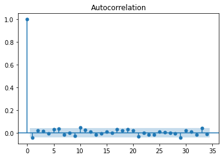
    


    
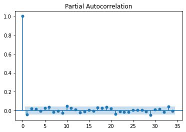
    


```python
plot_acf(BTC2)
plot_pacf(BTC2)
plt.show()
```


    
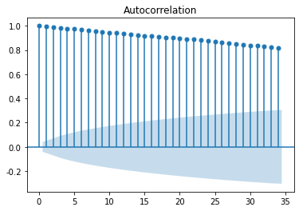
    


    
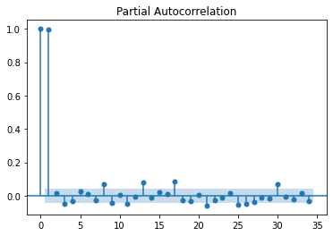
    


```python
def my_auto_arima(data, order,sort = 'AIC'):
  order_list = []
  aic_list = []
  bic_lsit = []
  for p in range(order[0]):
    for d in range(order[1]):
        for q in range(order[2]):
            model = ARIMA(data, order=(p,d,q))
            try:
                model_fit = model.fit()
                c_order = f'p{p} d{d} q{q}'
                aic = model_fit.aic
                bic = model_fit.bic
                order_list.append(c_order)
                aic_list.append(aic)
                bic_list.append(bic)
            except:
                pass
  result_df = pd.DataFrame(list(zip(order_list, aic_list)),columns=['order','AIC'])
  result_df.sort_values(sort, inplace=True)
  return result_df
```


```python
my_auto_arima(BTC,[3,3,3])
```

    C:\Anaconda3\lib\site-packages\statsmodels\tsa\base\tsa_model.py:524: ValueWarning: No frequency information was provided, so inferred frequency D will be used.
      warnings.warn('No frequency information was'
    C:\Anaconda3\lib\site-packages\statsmodels\tsa\base\tsa_model.py:524: ValueWarning: No frequency information was provided, so inferred frequency D will be used.
      warnings.warn('No frequency information was'
    C:\Anaconda3\lib\site-packages\statsmodels\tsa\base\tsa_model.py:524: ValueWarning: No frequency information was provided, so inferred frequency D will be used.
      warnings.warn('No frequency information was'
    C:\Anaconda3\lib\site-packages\statsmodels\tsa\base\tsa_model.py:524: ValueWarning: No frequency information was provided, so inferred frequency D will be used.
      warnings.warn('No frequency information was'
    C:\Anaconda3\lib\site-packages\statsmodels\tsa\base\tsa_model.py:524: ValueWarning: No frequency information was provided, so inferred frequency D will be used.
      warnings.warn('No frequency information was'
    C:\Anaconda3\lib\site-packages\statsmodels\tsa\base\tsa_model.py:524: ValueWarning: No frequency information was provided, so inferred frequency D will be used.
      warnings.warn('No frequency information was'
    C:\Anaconda3\lib\site-packages\statsmodels\tsa\base\tsa_model.py:524: ValueWarning: No frequency information was provided, so inferred frequency D will be used.
      warnings.warn('No frequency information was'
    C:\Anaconda3\lib\site-packages\statsmodels\tsa\base\tsa_model.py:524: ValueWarning: No frequency information was provided, so inferred frequency D will be used.
      warnings.warn('No frequency information was'
    C:\Anaconda3\lib\site-packages\statsmodels\tsa\base\tsa_model.py:524: ValueWarning: No frequency information was provided, so inferred frequency D will be used.
      warnings.warn('No frequency information was'
    C:\Anaconda3\lib\site-packages\statsmodels\tsa\base\tsa_model.py:524: ValueWarning: No frequency information was provided, so inferred frequency D will be used.
      warnings.warn('No frequency information was'
    C:\Anaconda3\lib\site-packages\statsmodels\tsa\base\tsa_model.py:524: ValueWarning: No frequency information was provided, so inferred frequency D will be used.
      warnings.warn('No frequency information was'
    C:\Anaconda3\lib\site-packages\statsmodels\tsa\base\tsa_model.py:524: ValueWarning: No frequency information was provided, so inferred frequency D will be used.
      warnings.warn('No frequency information was'
    C:\Anaconda3\lib\site-packages\statsmodels\tsa\base\tsa_model.py:524: ValueWarning: No frequency information was provided, so inferred frequency D will be used.
      warnings.warn('No frequency information was'
    C:\Anaconda3\lib\site-packages\statsmodels\tsa\base\tsa_model.py:524: ValueWarning: No frequency information was provided, so inferred frequency D will be used.
      warnings.warn('No frequency information was'
    C:\Anaconda3\lib\site-packages\statsmodels\tsa\base\tsa_model.py:524: ValueWarning: No frequency information was provided, so inferred frequency D will be used.
      warnings.warn('No frequency information was'
    C:\Anaconda3\lib\site-packages\statsmodels\tsa\base\tsa_model.py:524: ValueWarning: No frequency information was provided, so inferred frequency D will be used.
      warnings.warn('No frequency information was'
    C:\Anaconda3\lib\site-packages\statsmodels\tsa\base\tsa_model.py:524: ValueWarning: No frequency information was provided, so inferred frequency D will be used.
      warnings.warn('No frequency information was'
    C:\Anaconda3\lib\site-packages\statsmodels\tsa\base\tsa_model.py:524: ValueWarning: No frequency information was provided, so inferred frequency D will be used.
      warnings.warn('No frequency information was'
    C:\Anaconda3\lib\site-packages\statsmodels\tsa\base\tsa_model.py:524: ValueWarning: No frequency information was provided, so inferred frequency D will be used.
      warnings.warn('No frequency information was'
    C:\Anaconda3\lib\site-packages\statsmodels\tsa\base\tsa_model.py:524: ValueWarning: No frequency information was provided, so inferred frequency D will be used.
      warnings.warn('No frequency information was'
    C:\Anaconda3\lib\site-packages\statsmodels\tsa\base\tsa_model.py:524: ValueWarning: No frequency information was provided, so inferred frequency D will be used.
      warnings.warn('No frequency information was'
    C:\Anaconda3\lib\site-packages\statsmodels\tsa\base\tsa_model.py:524: ValueWarning: No frequency information was provided, so inferred frequency D will be used.
      warnings.warn('No frequency information was'
    C:\Anaconda3\lib\site-packages\statsmodels\tsa\base\tsa_model.py:524: ValueWarning: No frequency information was provided, so inferred frequency D will be used.
      warnings.warn('No frequency information was'
    C:\Anaconda3\lib\site-packages\statsmodels\tsa\base\tsa_model.py:524: ValueWarning: No frequency information was provided, so inferred frequency D will be used.
      warnings.warn('No frequency information was'
    C:\Anaconda3\lib\site-packages\statsmodels\tsa\base\tsa_model.py:524: ValueWarning: No frequency information was provided, so inferred frequency D will be used.
      warnings.warn('No frequency information was'
    C:\Anaconda3\lib\site-packages\statsmodels\tsa\base\tsa_model.py:524: ValueWarning: No frequency information was provided, so inferred frequency D will be used.
      warnings.warn('No frequency information was'
    C:\Anaconda3\lib\site-packages\statsmodels\tsa\base\tsa_model.py:524: ValueWarning: No frequency information was provided, so inferred frequency D will be used.
      warnings.warn('No frequency information was'
    C:\Anaconda3\lib\site-packages\statsmodels\tsa\base\tsa_model.py:524: ValueWarning: No frequency information was provided, so inferred frequency D will be used.
      warnings.warn('No frequency information was'
    C:\Anaconda3\lib\site-packages\statsmodels\tsa\base\tsa_model.py:524: ValueWarning: No frequency information was provided, so inferred frequency D will be used.
      warnings.warn('No frequency information was'
    C:\Anaconda3\lib\site-packages\statsmodels\tsa\base\tsa_model.py:524: ValueWarning: No frequency information was provided, so inferred frequency D will be used.
      warnings.warn('No frequency information was'
    C:\Anaconda3\lib\site-packages\statsmodels\tsa\base\tsa_model.py:524: ValueWarning: No frequency information was provided, so inferred frequency D will be used.
      warnings.warn('No frequency information was'
    C:\Anaconda3\lib\site-packages\statsmodels\tsa\base\tsa_model.py:524: ValueWarning: No frequency information was provided, so inferred frequency D will be used.
      warnings.warn('No frequency information was'
    C:\Anaconda3\lib\site-packages\statsmodels\tsa\base\tsa_model.py:524: ValueWarning: No frequency information was provided, so inferred frequency D will be used.
      warnings.warn('No frequency information was'
    C:\Anaconda3\lib\site-packages\statsmodels\tsa\base\tsa_model.py:524: ValueWarning: No frequency information was provided, so inferred frequency D will be used.
      warnings.warn('No frequency information was'
    C:\Anaconda3\lib\site-packages\statsmodels\tsa\base\tsa_model.py:524: ValueWarning: No frequency information was provided, so inferred frequency D will be used.
      warnings.warn('No frequency information was'
    C:\Anaconda3\lib\site-packages\statsmodels\tsa\base\tsa_model.py:524: ValueWarning: No frequency information was provided, so inferred frequency D will be used.
      warnings.warn('No frequency information was'
    C:\Anaconda3\lib\site-packages\statsmodels\tsa\base\tsa_model.py:524: ValueWarning: No frequency information was provided, so inferred frequency D will be used.
      warnings.warn('No frequency information was'
    C:\Anaconda3\lib\site-packages\statsmodels\tsa\base\tsa_model.py:524: ValueWarning: No frequency information was provided, so inferred frequency D will be used.
      warnings.warn('No frequency information was'
    C:\Anaconda3\lib\site-packages\statsmodels\tsa\base\tsa_model.py:524: ValueWarning: No frequency information was provided, so inferred frequency D will be used.
      warnings.warn('No frequency information was'
    C:\Anaconda3\lib\site-packages\statsmodels\tsa\base\tsa_model.py:524: ValueWarning: No frequency information was provided, so inferred frequency D will be used.
      warnings.warn('No frequency information was'
    C:\Anaconda3\lib\site-packages\statsmodels\tsa\base\tsa_model.py:524: ValueWarning: No frequency information was provided, so inferred frequency D will be used.
      warnings.warn('No frequency information was'
    C:\Anaconda3\lib\site-packages\statsmodels\tsa\base\tsa_model.py:524: ValueWarning: No frequency information was provided, so inferred frequency D will be used.
      warnings.warn('No frequency information was'
    C:\Anaconda3\lib\site-packages\statsmodels\tsa\base\tsa_model.py:524: ValueWarning: No frequency information was provided, so inferred frequency D will be used.
      warnings.warn('No frequency information was'
    C:\Anaconda3\lib\site-packages\statsmodels\tsa\base\tsa_model.py:524: ValueWarning: No frequency information was provided, so inferred frequency D will be used.
      warnings.warn('No frequency information was'
    C:\Anaconda3\lib\site-packages\statsmodels\tsa\base\tsa_model.py:524: ValueWarning: No frequency information was provided, so inferred frequency D will be used.
      warnings.warn('No frequency information was'
    


<div>
<style scoped>
    .dataframe tbody tr th:only-of-type {
        vertical-align: middle;
    }

    .dataframe tbody tr th {
        vertical-align: top;
    }

    .dataframe thead th {
        text-align: right;
    }
</style>
<table border="1" class="dataframe">
  <thead>
    <tr style="text-align: right;">
      <th></th>
      <th>order</th>
      <th>AIC</th>
    </tr>
  </thead>
  <tbody>
    <tr>
      <th>9</th>
      <td>p1 d0 q0</td>
      <td>12841.662072</td>
    </tr>
    <tr>
      <th>1</th>
      <td>p0 d0 q1</td>
      <td>12841.847717</td>
    </tr>
    <tr>
      <th>17</th>
      <td>p2 d0 q1</td>
      <td>12842.185531</td>
    </tr>
    <tr>
      <th>11</th>
      <td>p1 d0 q2</td>
      <td>12842.283509</td>
    </tr>
    <tr>
      <th>2</th>
      <td>p0 d0 q2</td>
      <td>12842.563189</td>
    </tr>
    <tr>
      <th>16</th>
      <td>p2 d0 q0</td>
      <td>12842.703320</td>
    </tr>
    <tr>
      <th>10</th>
      <td>p1 d0 q1</td>
      <td>12843.157397</td>
    </tr>
    <tr>
      <th>0</th>
      <td>p0 d0 q0</td>
      <td>12844.031494</td>
    </tr>
    <tr>
      <th>18</th>
      <td>p2 d0 q2</td>
      <td>12845.216489</td>
    </tr>
    <tr>
      <th>13</th>
      <td>p1 d1 q1</td>
      <td>12846.879664</td>
    </tr>
    <tr>
      <th>5</th>
      <td>p0 d1 q2</td>
      <td>12847.082135</td>
    </tr>
    <tr>
      <th>20</th>
      <td>p2 d1 q1</td>
      <td>12848.151010</td>
    </tr>
    <tr>
      <th>14</th>
      <td>p1 d1 q2</td>
      <td>12848.362315</td>
    </tr>
    <tr>
      <th>4</th>
      <td>p0 d1 q1</td>
      <td>12849.170484</td>
    </tr>
    <tr>
      <th>21</th>
      <td>p2 d1 q2</td>
      <td>12850.369302</td>
    </tr>
    <tr>
      <th>8</th>
      <td>p0 d2 q2</td>
      <td>12874.421481</td>
    </tr>
    <tr>
      <th>19</th>
      <td>p2 d1 q0</td>
      <td>13473.810863</td>
    </tr>
    <tr>
      <th>12</th>
      <td>p1 d1 q0</td>
      <td>13758.648509</td>
    </tr>
    <tr>
      <th>3</th>
      <td>p0 d1 q0</td>
      <td>14513.573264</td>
    </tr>
    <tr>
      <th>7</th>
      <td>p0 d2 q1</td>
      <td>14517.999039</td>
    </tr>
    <tr>
      <th>22</th>
      <td>p2 d2 q0</td>
      <td>14913.875889</td>
    </tr>
    <tr>
      <th>15</th>
      <td>p1 d2 q0</td>
      <td>15619.129354</td>
    </tr>
    <tr>
      <th>6</th>
      <td>p0 d2 q0</td>
      <td>17073.217044</td>
    </tr>
  </tbody>
</table>
</div>


```python
import statsmodels.api as sm

model = ARIMA(BTC, order=(1,0,0)) #파라미터 설정
model_fit = model.fit(trend='c', full_output=True, disp=True)
print(model_fit.summary())
```

                                  ARMA Model Results                              
    ==============================================================================
    Dep. Variable:                   r_종가   No. Observations:                 2309
    Model:                     ARMA(1, 0)   Log Likelihood               -6417.831
    Method:                       css-mle   S.D. of innovations              3.898
    Date:                Wed, 26 May 2021   AIC                          12841.662
    Time:                        19:25:59   BIC                          12858.896
    Sample:                    01-15-2015   HQIC                         12847.944
                             - 05-11-2021                                         
    ==============================================================================
                     coef    std err          z      P>|z|      [0.025      0.975]
    ------------------------------------------------------------------------------
    const          0.3294      0.078      4.239      0.000       0.177       0.482
    ar.L1.r_종가    -0.0439      0.021     -2.091      0.037      -0.085      -0.003
                                        Roots                                    
    =============================================================================
                      Real          Imaginary           Modulus         Frequency
    -----------------------------------------------------------------------------
    AR.1          -22.7654           +0.0000j           22.7654            0.5000
    -----------------------------------------------------------------------------
    

    C:\Anaconda3\lib\site-packages\statsmodels\tsa\base\tsa_model.py:524: ValueWarning: No frequency information was provided, so inferred frequency D will be used.
      warnings.warn('No frequency information was'
    


```python
fig = model_fit.plot_predict()
```


    
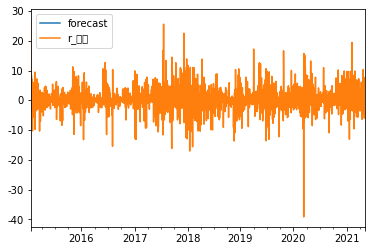
    


```python
residuals = pd.DataFrame(model_fit.resid)
residuals.plot()
```


    <AxesSubplot:xlabel='날짜'>


    
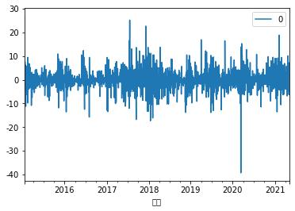
    


```python
my_auto_arima(BTC2,[3,3,3])
```

    C:\Anaconda3\lib\site-packages\statsmodels\tsa\base\tsa_model.py:524: ValueWarning: No frequency information was provided, so inferred frequency D will be used.
      warnings.warn('No frequency information was'
    C:\Anaconda3\lib\site-packages\statsmodels\tsa\base\tsa_model.py:524: ValueWarning: No frequency information was provided, so inferred frequency D will be used.
      warnings.warn('No frequency information was'
    C:\Anaconda3\lib\site-packages\statsmodels\tsa\base\tsa_model.py:524: ValueWarning: No frequency information was provided, so inferred frequency D will be used.
      warnings.warn('No frequency information was'
    C:\Anaconda3\lib\site-packages\statsmodels\tsa\base\tsa_model.py:524: ValueWarning: No frequency information was provided, so inferred frequency D will be used.
      warnings.warn('No frequency information was'
    C:\Anaconda3\lib\site-packages\statsmodels\tsa\base\tsa_model.py:524: ValueWarning: No frequency information was provided, so inferred frequency D will be used.
      warnings.warn('No frequency information was'
    C:\Anaconda3\lib\site-packages\statsmodels\tsa\base\tsa_model.py:524: ValueWarning: No frequency information was provided, so inferred frequency D will be used.
      warnings.warn('No frequency information was'
    C:\Anaconda3\lib\site-packages\statsmodels\tsa\base\tsa_model.py:524: ValueWarning: No frequency information was provided, so inferred frequency D will be used.
      warnings.warn('No frequency information was'
    C:\Anaconda3\lib\site-packages\statsmodels\tsa\base\tsa_model.py:524: ValueWarning: No frequency information was provided, so inferred frequency D will be used.
      warnings.warn('No frequency information was'
    C:\Anaconda3\lib\site-packages\statsmodels\tsa\base\tsa_model.py:524: ValueWarning: No frequency information was provided, so inferred frequency D will be used.
      warnings.warn('No frequency information was'
    C:\Anaconda3\lib\site-packages\statsmodels\tsa\base\tsa_model.py:524: ValueWarning: No frequency information was provided, so inferred frequency D will be used.
      warnings.warn('No frequency information was'
    C:\Anaconda3\lib\site-packages\statsmodels\tsa\base\tsa_model.py:524: ValueWarning: No frequency information was provided, so inferred frequency D will be used.
      warnings.warn('No frequency information was'
    C:\Anaconda3\lib\site-packages\statsmodels\tsa\base\tsa_model.py:524: ValueWarning: No frequency information was provided, so inferred frequency D will be used.
      warnings.warn('No frequency information was'
    C:\Anaconda3\lib\site-packages\statsmodels\tsa\base\tsa_model.py:524: ValueWarning: No frequency information was provided, so inferred frequency D will be used.
      warnings.warn('No frequency information was'
    C:\Anaconda3\lib\site-packages\statsmodels\tsa\base\tsa_model.py:524: ValueWarning: No frequency information was provided, so inferred frequency D will be used.
      warnings.warn('No frequency information was'
    C:\Anaconda3\lib\site-packages\statsmodels\tsa\base\tsa_model.py:524: ValueWarning: No frequency information was provided, so inferred frequency D will be used.
      warnings.warn('No frequency information was'
    C:\Anaconda3\lib\site-packages\statsmodels\tsa\base\tsa_model.py:524: ValueWarning: No frequency information was provided, so inferred frequency D will be used.
      warnings.warn('No frequency information was'
    C:\Anaconda3\lib\site-packages\statsmodels\tsa\base\tsa_model.py:524: ValueWarning: No frequency information was provided, so inferred frequency D will be used.
      warnings.warn('No frequency information was'
    C:\Anaconda3\lib\site-packages\statsmodels\tsa\base\tsa_model.py:524: ValueWarning: No frequency information was provided, so inferred frequency D will be used.
      warnings.warn('No frequency information was'
    C:\Anaconda3\lib\site-packages\statsmodels\tsa\base\tsa_model.py:524: ValueWarning: No frequency information was provided, so inferred frequency D will be used.
      warnings.warn('No frequency information was'
    C:\Anaconda3\lib\site-packages\statsmodels\tsa\base\tsa_model.py:524: ValueWarning: No frequency information was provided, so inferred frequency D will be used.
      warnings.warn('No frequency information was'
    C:\Anaconda3\lib\site-packages\statsmodels\tsa\base\tsa_model.py:524: ValueWarning: No frequency information was provided, so inferred frequency D will be used.
      warnings.warn('No frequency information was'
    C:\Anaconda3\lib\site-packages\statsmodels\tsa\base\tsa_model.py:524: ValueWarning: No frequency information was provided, so inferred frequency D will be used.
      warnings.warn('No frequency information was'
    C:\Anaconda3\lib\site-packages\statsmodels\tsa\base\tsa_model.py:524: ValueWarning: No frequency information was provided, so inferred frequency D will be used.
      warnings.warn('No frequency information was'
    C:\Anaconda3\lib\site-packages\statsmodels\tsa\base\tsa_model.py:524: ValueWarning: No frequency information was provided, so inferred frequency D will be used.
      warnings.warn('No frequency information was'
    C:\Anaconda3\lib\site-packages\statsmodels\tsa\base\tsa_model.py:524: ValueWarning: No frequency information was provided, so inferred frequency D will be used.
      warnings.warn('No frequency information was'
    C:\Anaconda3\lib\site-packages\statsmodels\tsa\base\tsa_model.py:524: ValueWarning: No frequency information was provided, so inferred frequency D will be used.
      warnings.warn('No frequency information was'
    C:\Anaconda3\lib\site-packages\statsmodels\tsa\base\tsa_model.py:524: ValueWarning: No frequency information was provided, so inferred frequency D will be used.
      warnings.warn('No frequency information was'
    C:\Anaconda3\lib\site-packages\statsmodels\tsa\base\tsa_model.py:524: ValueWarning: No frequency information was provided, so inferred frequency D will be used.
      warnings.warn('No frequency information was'
    C:\Anaconda3\lib\site-packages\statsmodels\tsa\base\tsa_model.py:524: ValueWarning: No frequency information was provided, so inferred frequency D will be used.
      warnings.warn('No frequency information was'
    C:\Anaconda3\lib\site-packages\statsmodels\tsa\base\tsa_model.py:524: ValueWarning: No frequency information was provided, so inferred frequency D will be used.
      warnings.warn('No frequency information was'
    C:\Anaconda3\lib\site-packages\statsmodels\tsa\base\tsa_model.py:524: ValueWarning: No frequency information was provided, so inferred frequency D will be used.
      warnings.warn('No frequency information was'
    C:\Anaconda3\lib\site-packages\statsmodels\tsa\base\tsa_model.py:524: ValueWarning: No frequency information was provided, so inferred frequency D will be used.
      warnings.warn('No frequency information was'
    C:\Anaconda3\lib\site-packages\statsmodels\tsa\base\tsa_model.py:524: ValueWarning: No frequency information was provided, so inferred frequency D will be used.
      warnings.warn('No frequency information was'
    C:\Anaconda3\lib\site-packages\statsmodels\tsa\base\tsa_model.py:524: ValueWarning: No frequency information was provided, so inferred frequency D will be used.
      warnings.warn('No frequency information was'
    C:\Anaconda3\lib\site-packages\statsmodels\tsa\base\tsa_model.py:524: ValueWarning: No frequency information was provided, so inferred frequency D will be used.
      warnings.warn('No frequency information was'
    C:\Anaconda3\lib\site-packages\statsmodels\tsa\base\tsa_model.py:524: ValueWarning: No frequency information was provided, so inferred frequency D will be used.
      warnings.warn('No frequency information was'
    C:\Anaconda3\lib\site-packages\statsmodels\tsa\base\tsa_model.py:524: ValueWarning: No frequency information was provided, so inferred frequency D will be used.
      warnings.warn('No frequency information was'
    C:\Anaconda3\lib\site-packages\statsmodels\tsa\base\tsa_model.py:524: ValueWarning: No frequency information was provided, so inferred frequency D will be used.
      warnings.warn('No frequency information was'
    C:\Anaconda3\lib\site-packages\statsmodels\tsa\base\tsa_model.py:524: ValueWarning: No frequency information was provided, so inferred frequency D will be used.
      warnings.warn('No frequency information was'
    C:\Anaconda3\lib\site-packages\statsmodels\tsa\base\tsa_model.py:524: ValueWarning: No frequency information was provided, so inferred frequency D will be used.
      warnings.warn('No frequency information was'
    C:\Anaconda3\lib\site-packages\statsmodels\tsa\base\tsa_model.py:524: ValueWarning: No frequency information was provided, so inferred frequency D will be used.
      warnings.warn('No frequency information was'
    C:\Anaconda3\lib\site-packages\statsmodels\tsa\base\tsa_model.py:524: ValueWarning: No frequency information was provided, so inferred frequency D will be used.
      warnings.warn('No frequency information was'
    C:\Anaconda3\lib\site-packages\statsmodels\tsa\base\tsa_model.py:524: ValueWarning: No frequency information was provided, so inferred frequency D will be used.
      warnings.warn('No frequency information was'
    C:\Anaconda3\lib\site-packages\statsmodels\tsa\base\tsa_model.py:524: ValueWarning: No frequency information was provided, so inferred frequency D will be used.
      warnings.warn('No frequency information was'
    C:\Anaconda3\lib\site-packages\statsmodels\tsa\base\tsa_model.py:524: ValueWarning: No frequency information was provided, so inferred frequency D will be used.
      warnings.warn('No frequency information was'
    


<div>
<style scoped>
    .dataframe tbody tr th:only-of-type {
        vertical-align: middle;
    }

    .dataframe tbody tr th {
        vertical-align: top;
    }

    .dataframe thead th {
        text-align: right;
    }
</style>
<table border="1" class="dataframe">
  <thead>
    <tr style="text-align: right;">
      <th></th>
      <th>order</th>
      <th>AIC</th>
    </tr>
  </thead>
  <tbody>
    <tr>
      <th>19</th>
      <td>p2 d1 q2</td>
      <td>35796.343409</td>
    </tr>
    <tr>
      <th>7</th>
      <td>p0 d2 q1</td>
      <td>35831.974079</td>
    </tr>
    <tr>
      <th>14</th>
      <td>p1 d2 q1</td>
      <td>35832.321772</td>
    </tr>
    <tr>
      <th>8</th>
      <td>p0 d2 q2</td>
      <td>35832.377199</td>
    </tr>
    <tr>
      <th>21</th>
      <td>p2 d2 q1</td>
      <td>35833.777557</td>
    </tr>
    <tr>
      <th>15</th>
      <td>p1 d2 q2</td>
      <td>35834.229824</td>
    </tr>
    <tr>
      <th>22</th>
      <td>p2 d2 q2</td>
      <td>35834.773294</td>
    </tr>
    <tr>
      <th>12</th>
      <td>p1 d1 q2</td>
      <td>35845.094025</td>
    </tr>
    <tr>
      <th>3</th>
      <td>p0 d1 q0</td>
      <td>35845.428777</td>
    </tr>
    <tr>
      <th>18</th>
      <td>p2 d1 q1</td>
      <td>35845.718709</td>
    </tr>
    <tr>
      <th>10</th>
      <td>p1 d1 q0</td>
      <td>35846.479353</td>
    </tr>
    <tr>
      <th>4</th>
      <td>p0 d1 q1</td>
      <td>35846.522397</td>
    </tr>
    <tr>
      <th>5</th>
      <td>p0 d1 q2</td>
      <td>35846.927677</td>
    </tr>
    <tr>
      <th>17</th>
      <td>p2 d1 q0</td>
      <td>35847.330717</td>
    </tr>
    <tr>
      <th>11</th>
      <td>p1 d1 q1</td>
      <td>35848.335373</td>
    </tr>
    <tr>
      <th>9</th>
      <td>p1 d0 q0</td>
      <td>35875.114617</td>
    </tr>
    <tr>
      <th>16</th>
      <td>p2 d0 q0</td>
      <td>35876.343561</td>
    </tr>
    <tr>
      <th>20</th>
      <td>p2 d2 q0</td>
      <td>36399.238868</td>
    </tr>
    <tr>
      <th>13</th>
      <td>p1 d2 q0</td>
      <td>36746.092975</td>
    </tr>
    <tr>
      <th>6</th>
      <td>p0 d2 q0</td>
      <td>37475.275658</td>
    </tr>
    <tr>
      <th>2</th>
      <td>p0 d0 q2</td>
      <td>44164.454504</td>
    </tr>
    <tr>
      <th>1</th>
      <td>p0 d0 q1</td>
      <td>46684.834318</td>
    </tr>
    <tr>
      <th>0</th>
      <td>p0 d0 q0</td>
      <td>49693.765689</td>
    </tr>
  </tbody>
</table>
</div>


```python
import statsmodels.api as sm

model2 = ARIMA(BTC2, order=(2,1,2)) #파라미터 설정
model2_fit = model2.fit(trend='c', full_output=True, disp=True)
print(model2_fit.summary())
```

    C:\Anaconda3\lib\site-packages\statsmodels\tsa\base\tsa_model.py:524: ValueWarning: No frequency information was provided, so inferred frequency D will be used.
      warnings.warn('No frequency information was'
    C:\Anaconda3\lib\site-packages\statsmodels\tsa\base\tsa_model.py:524: ValueWarning: No frequency information was provided, so inferred frequency D will be used.
      warnings.warn('No frequency information was'
    

                                 ARIMA Model Results                              
    ==============================================================================
    Dep. Variable:                   D.종가   No. Observations:                 2308
    Model:                 ARIMA(2, 1, 2)   Log Likelihood              -17892.172
    Method:                       css-mle   S.D. of innovations            562.968
    Date:                Wed, 26 May 2021   AIC                          35796.343
    Time:                        19:29:07   BIC                          35830.808
    Sample:                    01-16-2015   HQIC                         35808.907
                             - 05-11-2021                                         
    ==============================================================================
                     coef    std err          z      P>|z|      [0.025      0.975]
    ------------------------------------------------------------------------------
    const         24.4738     12.737      1.921      0.055      -0.490      49.438
    ar.L1.D.종가     1.2726      0.041     31.174      0.000       1.193       1.353
    ar.L2.D.종가    -0.8596      0.032    -26.685      0.000      -0.923      -0.796
    ma.L1.D.종가    -1.2943      0.030    -42.854      0.000      -1.354      -1.235
    ma.L2.D.종가     0.9323      0.021     44.570      0.000       0.891       0.973
                                        Roots                                    
    =============================================================================
                      Real          Imaginary           Modulus         Frequency
    -----------------------------------------------------------------------------
    AR.1            0.7403           -0.7845j            1.0786           -0.1296
    AR.2            0.7403           +0.7845j            1.0786            0.1296
    MA.1            0.6941           -0.7686j            1.0357           -0.1331
    MA.2            0.6941           +0.7686j            1.0357            0.1331
    -----------------------------------------------------------------------------
    


```python
fig = model2_fit.plot_predict()
```


    
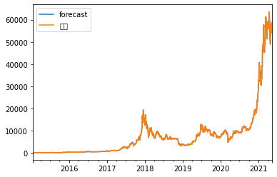
    


```python
residuals = pd.DataFrame(model2_fit.resid)
residuals.plot()
```


    <AxesSubplot:xlabel='날짜'>


    
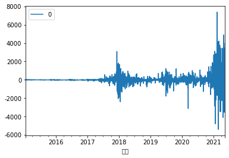
    


```python

```


```python
data2 = df.iloc[:14]
```


```python
data2 = data2.iloc[::-1]
```


```python
data2
```


<div>
<style scoped>
    .dataframe tbody tr th:only-of-type {
        vertical-align: middle;
    }

    .dataframe tbody tr th {
        vertical-align: top;
    }

    .dataframe thead th {
        text-align: right;
    }
</style>
<table border="1" class="dataframe">
  <thead>
    <tr style="text-align: right;">
      <th></th>
      <th>날짜</th>
      <th>종가</th>
      <th>오픈</th>
      <th>고가</th>
      <th>저가</th>
      <th>거래량</th>
      <th>변동 %</th>
    </tr>
  </thead>
  <tbody>
    <tr>
      <th>13</th>
      <td>2021-05-12</td>
      <td>49384.2</td>
      <td>56694.5</td>
      <td>57938.5</td>
      <td>49187.0</td>
      <td>160.74K</td>
      <td>-0.1290</td>
    </tr>
    <tr>
      <th>12</th>
      <td>2021-05-13</td>
      <td>49704.6</td>
      <td>49398.2</td>
      <td>51337.3</td>
      <td>46331.1</td>
      <td>236.71K</td>
      <td>0.0065</td>
    </tr>
    <tr>
      <th>11</th>
      <td>2021-05-14</td>
      <td>49839.8</td>
      <td>49704.9</td>
      <td>51459.2</td>
      <td>48874.0</td>
      <td>118.84K</td>
      <td>0.0027</td>
    </tr>
    <tr>
      <th>10</th>
      <td>2021-05-15</td>
      <td>46708.8</td>
      <td>49839.1</td>
      <td>50640.9</td>
      <td>46650.2</td>
      <td>131.91K</td>
      <td>-0.0628</td>
    </tr>
    <tr>
      <th>9</th>
      <td>2021-05-16</td>
      <td>46426.4</td>
      <td>46729.3</td>
      <td>49764.3</td>
      <td>43920.8</td>
      <td>180.07K</td>
      <td>-0.0060</td>
    </tr>
    <tr>
      <th>8</th>
      <td>2021-05-17</td>
      <td>43541.3</td>
      <td>46424.2</td>
      <td>46545.4</td>
      <td>42201.5</td>
      <td>274.76K</td>
      <td>-0.0621</td>
    </tr>
    <tr>
      <th>7</th>
      <td>2021-05-18</td>
      <td>42897.3</td>
      <td>43538.5</td>
      <td>45770.9</td>
      <td>42293.9</td>
      <td>154.96K</td>
      <td>-0.0148</td>
    </tr>
    <tr>
      <th>6</th>
      <td>2021-05-19</td>
      <td>36720.5</td>
      <td>42898.3</td>
      <td>43516.6</td>
      <td>30261.7</td>
      <td>607.10K</td>
      <td>-0.1440</td>
    </tr>
    <tr>
      <th>5</th>
      <td>2021-05-20</td>
      <td>40717.2</td>
      <td>36706.8</td>
      <td>42425.9</td>
      <td>35010.4</td>
      <td>269.75K</td>
      <td>0.1088</td>
    </tr>
    <tr>
      <th>4</th>
      <td>2021-05-21</td>
      <td>37297.4</td>
      <td>40611.2</td>
      <td>42108.3</td>
      <td>33592.3</td>
      <td>315.50K</td>
      <td>-0.0840</td>
    </tr>
    <tr>
      <th>3</th>
      <td>2021-05-22</td>
      <td>37448.3</td>
      <td>37291.0</td>
      <td>38776.0</td>
      <td>35314.9</td>
      <td>185.83K</td>
      <td>0.0040</td>
    </tr>
    <tr>
      <th>2</th>
      <td>2021-05-23</td>
      <td>34679.7</td>
      <td>37446.8</td>
      <td>38248.7</td>
      <td>31192.4</td>
      <td>325.73K</td>
      <td>-0.0739</td>
    </tr>
    <tr>
      <th>1</th>
      <td>2021-05-24</td>
      <td>38750.6</td>
      <td>34720.3</td>
      <td>39851.7</td>
      <td>34474.6</td>
      <td>244.88K</td>
      <td>0.1174</td>
    </tr>
    <tr>
      <th>0</th>
      <td>2021-05-25</td>
      <td>37555.9</td>
      <td>38753.6</td>
      <td>39740.8</td>
      <td>36540.7</td>
      <td>171.85K</td>
      <td>-0.0308</td>
    </tr>
  </tbody>
</table>
</div>


```python
data2 = data2.set_index('날짜')
```


```python
test_data = pd.DataFrame(data2['종가'])
```


```python
test_data
```


<div>
<style scoped>
    .dataframe tbody tr th:only-of-type {
        vertical-align: middle;
    }

    .dataframe tbody tr th {
        vertical-align: top;
    }

    .dataframe thead th {
        text-align: right;
    }
</style>
<table border="1" class="dataframe">
  <thead>
    <tr style="text-align: right;">
      <th></th>
      <th>종가</th>
    </tr>
    <tr>
      <th>날짜</th>
      <th></th>
    </tr>
  </thead>
  <tbody>
    <tr>
      <th>2021-05-12</th>
      <td>49384.2</td>
    </tr>
    <tr>
      <th>2021-05-13</th>
      <td>49704.6</td>
    </tr>
    <tr>
      <th>2021-05-14</th>
      <td>49839.8</td>
    </tr>
    <tr>
      <th>2021-05-15</th>
      <td>46708.8</td>
    </tr>
    <tr>
      <th>2021-05-16</th>
      <td>46426.4</td>
    </tr>
    <tr>
      <th>2021-05-17</th>
      <td>43541.3</td>
    </tr>
    <tr>
      <th>2021-05-18</th>
      <td>42897.3</td>
    </tr>
    <tr>
      <th>2021-05-19</th>
      <td>36720.5</td>
    </tr>
    <tr>
      <th>2021-05-20</th>
      <td>40717.2</td>
    </tr>
    <tr>
      <th>2021-05-21</th>
      <td>37297.4</td>
    </tr>
    <tr>
      <th>2021-05-22</th>
      <td>37448.3</td>
    </tr>
    <tr>
      <th>2021-05-23</th>
      <td>34679.7</td>
    </tr>
    <tr>
      <th>2021-05-24</th>
      <td>38750.6</td>
    </tr>
    <tr>
      <th>2021-05-25</th>
      <td>37555.9</td>
    </tr>
  </tbody>
</table>
</div>


```python
for i in test_data:
    test_data['r_'+i] = 100*test_data[i].pct_change()

test_data.dropna(inplace=True)
test_data
```


<div>
<style scoped>
    .dataframe tbody tr th:only-of-type {
        vertical-align: middle;
    }

    .dataframe tbody tr th {
        vertical-align: top;
    }

    .dataframe thead th {
        text-align: right;
    }
</style>
<table border="1" class="dataframe">
  <thead>
    <tr style="text-align: right;">
      <th></th>
      <th>종가</th>
      <th>r_종가</th>
    </tr>
    <tr>
      <th>날짜</th>
      <th></th>
      <th></th>
    </tr>
  </thead>
  <tbody>
    <tr>
      <th>2021-05-13</th>
      <td>49704.6</td>
      <td>0.648791</td>
    </tr>
    <tr>
      <th>2021-05-14</th>
      <td>49839.8</td>
      <td>0.272007</td>
    </tr>
    <tr>
      <th>2021-05-15</th>
      <td>46708.8</td>
      <td>-6.282128</td>
    </tr>
    <tr>
      <th>2021-05-16</th>
      <td>46426.4</td>
      <td>-0.604597</td>
    </tr>
    <tr>
      <th>2021-05-17</th>
      <td>43541.3</td>
      <td>-6.214352</td>
    </tr>
    <tr>
      <th>2021-05-18</th>
      <td>42897.3</td>
      <td>-1.479056</td>
    </tr>
    <tr>
      <th>2021-05-19</th>
      <td>36720.5</td>
      <td>-14.399041</td>
    </tr>
    <tr>
      <th>2021-05-20</th>
      <td>40717.2</td>
      <td>10.884111</td>
    </tr>
    <tr>
      <th>2021-05-21</th>
      <td>37297.4</td>
      <td>-8.398908</td>
    </tr>
    <tr>
      <th>2021-05-22</th>
      <td>37448.3</td>
      <td>0.404586</td>
    </tr>
    <tr>
      <th>2021-05-23</th>
      <td>34679.7</td>
      <td>-7.393126</td>
    </tr>
    <tr>
      <th>2021-05-24</th>
      <td>38750.6</td>
      <td>11.738568</td>
    </tr>
    <tr>
      <th>2021-05-25</th>
      <td>37555.9</td>
      <td>-3.083049</td>
    </tr>
  </tbody>
</table>
</div>


```python

```


```python
pred_model = model_fit.forecast(steps=13) 
pred=pred_model[0].tolist()
```


```python
test=test_data.r_종가.tolist()
plt.plot(pred, color="blue")
plt.plot(test, color = "red")
```


    [<matplotlib.lines.Line2D at 0x1a697ab6df0>]


    
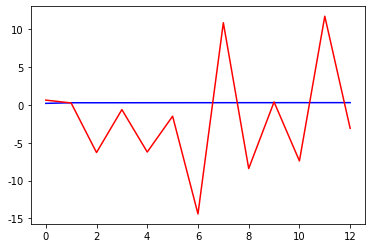
    


```python
pred
```


    [0.21819864759185625,
     0.29957589763954356,
     0.29745285870275684,
     0.3001726560843518,
     0.3024154573781012,
     0.3045156121868703,
     0.3064651448874073,
     0.3082758789818083,
     0.3099576346765536,
     0.31151960281327645,
     0.31297031535710523,
     0.3143176968155013,
     0.315569107235135]


```python
test
```


    [0.6487905038453645,
     0.2720070174591527,
     -6.2821279379130734,
     -0.6045969924296957,
     -6.2143521789326694,
     -1.4790555174053144,
     -14.399041431512016,
     10.884111055132696,
     -8.398907586965699,
     0.40458584244478235,
     -7.393125989697813,
     11.738567519326871,
     -3.0830490366600682]


```python
pred_model2 = model2_fit.forecast(steps=13) 
pred2=pred_model2[0].tolist()
```


```python
test2=test_data.종가.tolist()
plt.plot(pred2, color="blue")
plt.plot(test2, color = "red")
```


    [<matplotlib.lines.Line2D at 0x1a697a78670>]


    
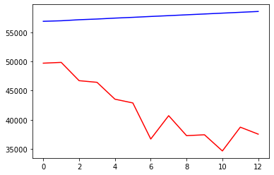
    


```python
from sklearn.metrics import mean_squared_error
import math

rmse = math.sqrt(mean_squared_error(pred, test))
print(rmse)
```

    7.313560981750317
    


```python
rmse = math.sqrt(mean_squared_error(pred2, test2))
print(rmse)
```

    16889.82232897358
    


```python

```


```python

```

# 2. LSTM을 이용한 가격 예측 모델


```python
import pandas as pd
import numpy as np
import matplotlib.pyplot as plt
from keras.models import Sequential
from keras.layers import LSTM, Dropout, Dense, Activation
from keras.callbacks import TensorBoard, ModelCheckpoint, ReduceLROnPlateau
import datetime
```


```python
#data = BTC.values
```


```python
#data
```


```python
#data2 = BTC2.values
```


```python
#data2
```


```python
from sklearn.preprocessing import MinMaxScaler

min_max_scaler = MinMaxScaler()
mm_scale = min_max_scaler.fit_transform(data)
mm_scale = pd.DataFrame(mm_scale, columns = data.columns, index=list(data.index.values))

```


```python
mm_scale
```


<div>
<style scoped>
    .dataframe tbody tr th:only-of-type {
        vertical-align: middle;
    }

    .dataframe tbody tr th {
        vertical-align: top;
    }

    .dataframe thead th {
        text-align: right;
    }
</style>
<table border="1" class="dataframe">
  <thead>
    <tr style="text-align: right;">
      <th></th>
      <th>종가</th>
      <th>r_종가</th>
    </tr>
  </thead>
  <tbody>
    <tr>
      <th>2015-01-15</th>
      <td>0.000161</td>
      <td>1.000000</td>
    </tr>
    <tr>
      <th>2015-01-16</th>
      <td>0.000115</td>
      <td>0.569179</td>
    </tr>
    <tr>
      <th>2015-01-17</th>
      <td>0.000000</td>
      <td>0.536865</td>
    </tr>
    <tr>
      <th>2015-01-18</th>
      <td>0.000174</td>
      <td>0.672978</td>
    </tr>
    <tr>
      <th>2015-01-19</th>
      <td>0.000257</td>
      <td>0.627889</td>
    </tr>
    <tr>
      <th>...</th>
      <td>...</td>
      <td>...</td>
    </tr>
    <tr>
      <th>2021-05-07</th>
      <td>0.902059</td>
      <td>0.614869</td>
    </tr>
    <tr>
      <th>2021-05-08</th>
      <td>0.925786</td>
      <td>0.629463</td>
    </tr>
    <tr>
      <th>2021-05-09</th>
      <td>0.916285</td>
      <td>0.574593</td>
    </tr>
    <tr>
      <th>2021-05-10</th>
      <td>0.878563</td>
      <td>0.528214</td>
    </tr>
    <tr>
      <th>2021-05-11</th>
      <td>0.891931</td>
      <td>0.612825</td>
    </tr>
  </tbody>
</table>
<p>2309 rows × 2 columns</p>
</div>


```python
mm_scale2 = min_max_scaler.fit_transform(test_data)
mm_scale2 = pd.DataFrame(mm_scale2, columns = test_data.columns, index=list(test_data.index.values))
```


```python
mm_scale2
```


<div>
<style scoped>
    .dataframe tbody tr th:only-of-type {
        vertical-align: middle;
    }

    .dataframe tbody tr th {
        vertical-align: top;
    }

    .dataframe thead th {
        text-align: right;
    }
</style>
<table border="1" class="dataframe">
  <thead>
    <tr style="text-align: right;">
      <th></th>
      <th>종가</th>
      <th>r_종가</th>
    </tr>
  </thead>
  <tbody>
    <tr>
      <th>2021-05-13</th>
      <td>0.991082</td>
      <td>0.575716</td>
    </tr>
    <tr>
      <th>2021-05-14</th>
      <td>1.000000</td>
      <td>0.561300</td>
    </tr>
    <tr>
      <th>2021-05-15</th>
      <td>0.793471</td>
      <td>0.310545</td>
    </tr>
    <tr>
      <th>2021-05-16</th>
      <td>0.774843</td>
      <td>0.527762</td>
    </tr>
    <tr>
      <th>2021-05-17</th>
      <td>0.584534</td>
      <td>0.313138</td>
    </tr>
    <tr>
      <th>2021-05-18</th>
      <td>0.542054</td>
      <td>0.494306</td>
    </tr>
    <tr>
      <th>2021-05-19</th>
      <td>0.134617</td>
      <td>0.000000</td>
    </tr>
    <tr>
      <th>2021-05-20</th>
      <td>0.398249</td>
      <td>0.967309</td>
    </tr>
    <tr>
      <th>2021-05-21</th>
      <td>0.172670</td>
      <td>0.229559</td>
    </tr>
    <tr>
      <th>2021-05-22</th>
      <td>0.182624</td>
      <td>0.566373</td>
    </tr>
    <tr>
      <th>2021-05-23</th>
      <td>0.000000</td>
      <td>0.268040</td>
    </tr>
    <tr>
      <th>2021-05-24</th>
      <td>0.268527</td>
      <td>1.000000</td>
    </tr>
    <tr>
      <th>2021-05-25</th>
      <td>0.189722</td>
      <td>0.432939</td>
    </tr>
  </tbody>
</table>
</div>


```python
def univariate_data(dataset, start_index, end_index, history_size, target_size):
  data = []
  labels = []

  start_index = start_index + history_size
  if end_index is None:
    end_index = len(dataset) - target_size

  for i in range(start_index, end_index):
    indices = range(i-history_size, i)
    # Reshape data from (history_size,) to (history_size, 1)
    data.append(np.reshape(dataset[indices], (history_size, 1)))
    labels.append(dataset[i+target_size])
  return np.array(data), np.array(labels)
```


```python
import tensorflow as tf
TRAIN_SPLIT = 2000
tf.random.set_seed(13)
```


```python
uni_data = mm_scale.종가.values
```


```python
univariate_past_history = 50
univariate_future_target = 0

x_train_uni, y_train_uni = univariate_data(uni_data, 0, TRAIN_SPLIT,
                                           univariate_past_history,
                                           univariate_future_target)
x_val_uni, y_val_uni = univariate_data(uni_data, TRAIN_SPLIT, None,
                                       univariate_past_history,
                                       univariate_future_target)
```


```python
print ('Single window of past history')
print (x_train_uni[0])
print ('\n Target temperature to predict')
print (y_train_uni[0])
```

    Single window of past history
    [[0.00016103]
     [0.00011525]
     [0.        ]
     [0.00017366]
     [0.00025734]
     [0.00017366]
     [0.00045152]
     [0.00052257]
     [0.00051467]
     [0.00076727]
     [0.00082884]
     [0.00109881]
     [0.00100566]
     [0.00057782]
     [0.00054309]
     [0.00050836]
     [0.00029838]
     [0.00040574]
     [0.00062045]
     [0.00043889]
     [0.00042626]
     [0.00026681]
     [0.00036943]
     [0.00044363]
     [0.00038048]
     [0.0003268 ]
     [0.00031733]
     [0.00030312]
     [0.00035048]
     [0.00057782]
     [0.00093146]
     [0.00053204]
     [0.00057151]
     [0.00068833]
     [0.00056203]
     [0.00066781]
     [0.00070886]
     [0.00070728]
     [0.00056993]
     [0.00061887]
     [0.00062045]
     [0.00059519]
     [0.00058256]
     [0.00085095]
     [0.00086042]
     [0.00092041]
     [0.00117143]
     [0.00127879]
     [0.00114144]
     [0.00119353]]
    
     Target temperature to predict
    0.0011524866082634872
    


```python
def create_time_steps(length):
  return list(range(-length, 0))
```


```python
def show_plot(plot_data, delta, title):
  labels = ['History', 'True Future', 'Model Prediction']
  marker = ['.-', 'rx', 'go']
  time_steps = create_time_steps(plot_data[0].shape[0])
  if delta:
    future = delta
  else:
    future = 0

  plt.title(title)
  for i, x in enumerate(plot_data):
    if i:
      plt.plot(future, plot_data[i], marker[i], markersize=10,
               label=labels[i])
    else:
      plt.plot(time_steps, plot_data[i].flatten(), marker[i], label=labels[i])
  plt.legend()
  plt.xlim([time_steps[0], (future+5)*2])
  plt.xlabel('Time-Step')
  return plt
```


```python
show_plot([x_train_uni[0], y_train_uni[0]], 0, 'Sample Example')
```


    <module 'matplotlib.pyplot' from 'C:\\Anaconda3\\lib\\site-packages\\matplotlib\\pyplot.py'>


    
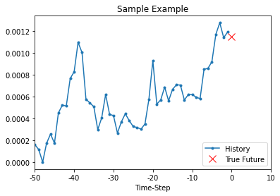
    


```python
def baseline(history):
  return np.mean(history)
```


```python
show_plot([x_train_uni[0], y_train_uni[0], baseline(x_train_uni[0])], 0,
           'Baseline Prediction Example')
```


    <module 'matplotlib.pyplot' from 'C:\\Anaconda3\\lib\\site-packages\\matplotlib\\pyplot.py'>


    
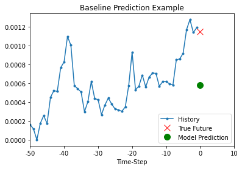
    


```python
BATCH_SIZE = 256
BUFFER_SIZE = 10000

train_univariate = tf.data.Dataset.from_tensor_slices((x_train_uni, y_train_uni))
train_univariate = train_univariate.cache().shuffle(BUFFER_SIZE).batch(BATCH_SIZE).repeat()

val_univariate = tf.data.Dataset.from_tensor_slices((x_val_uni, y_val_uni))
val_univariate = val_univariate.batch(BATCH_SIZE).repeat()
```


```python
simple_lstm_model = tf.keras.models.Sequential([
    tf.keras.layers.LSTM(8, input_shape=x_train_uni.shape[-2:]),
    tf.keras.layers.Dense(1)
])

simple_lstm_model.compile(optimizer='adam', loss='mae')
```


```python
for x, y in val_univariate.take(1):
    print(simple_lstm_model.predict(x).shape)
```

    (256, 1)
    


```python
model = Sequential()

model.add(LSTM(50, return_sequences=True, input_shape=(50, 1)))

model.add(LSTM(64, return_sequences=False))

model.add(Dense(1, activation='linear'))

model.compile(loss='mse', optimizer='rmsprop')

model.summary()
```

    Model: "sequential_1"
    _________________________________________________________________
    Layer (type)                 Output Shape              Param #   
    =================================================================
    lstm_1 (LSTM)                (None, 50, 50)            10400     
    _________________________________________________________________
    lstm_2 (LSTM)                (None, 64)                29440     
    _________________________________________________________________
    dense_1 (Dense)              (None, 1)                 65        
    =================================================================
    Total params: 39,905
    Trainable params: 39,905
    Non-trainable params: 0
    _________________________________________________________________
    


```python
start_time = datetime.datetime.now().strftime('%Y_%m_%d_%H_%M_%S')

model.fit(x_train_uni, y_train_uni,
    validation_data=(x_val_uni, y_val_uni),
    batch_size=10,
    epochs=20,
    callbacks=[
        TensorBoard(log_dir='logs/%s' % (start_time)),
        ModelCheckpoint('./models/%s_eth.h5' % (start_time), monitor='val_loss', verbose=1, save_best_only=True, mode='auto'),
        ReduceLROnPlateau(monitor='val_loss', factor=0.2, patience=5, verbose=1, mode='auto')
])
```

    Epoch 1/20
      1/195 [..............................] - ETA: 0s - loss: 0.0159WARNING:tensorflow:From C:\Anaconda3\lib\site-packages\tensorflow\python\ops\summary_ops_v2.py:1277: stop (from tensorflow.python.eager.profiler) is deprecated and will be removed after 2020-07-01.
    Instructions for updating:
    use `tf.profiler.experimental.stop` instead.
      2/195 [..............................] - ETA: 10s - loss: 0.0088WARNING:tensorflow:Callbacks method `on_train_batch_end` is slow compared to the batch time (batch time: 0.0110s vs `on_train_batch_end` time: 0.1004s). Check your callbacks.
    193/195 [============================>.] - ETA: 0s - loss: 4.4102e-04
    Epoch 00001: val_loss improved from inf to 0.00709, saving model to ./models\2021_05_26_19_17_19_eth.h5
    195/195 [==============================] - 2s 11ms/step - loss: 4.3992e-04 - val_loss: 0.0071
    Epoch 2/20
    194/195 [============================>.] - ETA: 0s - loss: 1.5569e-04
    Epoch 00002: val_loss did not improve from 0.00709
    195/195 [==============================] - 1s 7ms/step - loss: 1.5696e-04 - val_loss: 0.0151
    Epoch 3/20
    193/195 [============================>.] - ETA: 0s - loss: 1.1880e-04
    Epoch 00003: val_loss improved from 0.00709 to 0.00222, saving model to ./models\2021_05_26_19_17_19_eth.h5
    195/195 [==============================] - 1s 7ms/step - loss: 1.1800e-04 - val_loss: 0.0022
    Epoch 4/20
    195/195 [==============================] - ETA: 0s - loss: 9.8835e-05
    Epoch 00004: val_loss did not improve from 0.00222
    195/195 [==============================] - 1s 7ms/step - loss: 9.8835e-05 - val_loss: 0.0050
    Epoch 5/20
    195/195 [==============================] - ETA: 0s - loss: 8.2337e-05
    Epoch 00005: val_loss did not improve from 0.00222
    195/195 [==============================] - 1s 8ms/step - loss: 8.2337e-05 - val_loss: 0.0096
    Epoch 6/20
    189/195 [============================>.] - ETA: 0s - loss: 7.1477e-05
    Epoch 00006: val_loss improved from 0.00222 to 0.00172, saving model to ./models\2021_05_26_19_17_19_eth.h5
    195/195 [==============================] - 1s 8ms/step - loss: 7.4049e-05 - val_loss: 0.0017
    Epoch 7/20
    193/195 [============================>.] - ETA: 0s - loss: 6.7411e-05
    Epoch 00007: val_loss did not improve from 0.00172
    195/195 [==============================] - 1s 8ms/step - loss: 6.6772e-05 - val_loss: 0.0045
    Epoch 8/20
    191/195 [============================>.] - ETA: 0s - loss: 6.0091e-05
    Epoch 00008: val_loss did not improve from 0.00172
    195/195 [==============================] - 2s 8ms/step - loss: 5.9535e-05 - val_loss: 0.0030
    Epoch 9/20
    194/195 [============================>.] - ETA: 0s - loss: 5.7487e-05
    Epoch 00009: val_loss did not improve from 0.00172
    195/195 [==============================] - 1s 8ms/step - loss: 5.7940e-05 - val_loss: 0.0049
    Epoch 10/20
    193/195 [============================>.] - ETA: 0s - loss: 5.2508e-05
    Epoch 00010: val_loss did not improve from 0.00172
    195/195 [==============================] - 1s 7ms/step - loss: 5.2052e-05 - val_loss: 0.0018
    Epoch 11/20
    191/195 [============================>.] - ETA: 0s - loss: 5.1194e-05
    Epoch 00011: val_loss did not improve from 0.00172
    
    Epoch 00011: ReduceLROnPlateau reducing learning rate to 0.00020000000949949026.
    195/195 [==============================] - 1s 7ms/step - loss: 5.0775e-05 - val_loss: 0.0030
    Epoch 12/20
    193/195 [============================>.] - ETA: 0s - loss: 2.4201e-05
    Epoch 00012: val_loss did not improve from 0.00172
    195/195 [==============================] - 1s 7ms/step - loss: 2.4092e-05 - val_loss: 0.0039
    Epoch 13/20
    193/195 [============================>.] - ETA: 0s - loss: 2.3974e-05
    Epoch 00013: val_loss did not improve from 0.00172
    195/195 [==============================] - 1s 7ms/step - loss: 2.4222e-05 - val_loss: 0.0031
    Epoch 14/20
    195/195 [==============================] - ETA: 0s - loss: 2.4354e-05
    Epoch 00014: val_loss did not improve from 0.00172
    195/195 [==============================] - 1s 7ms/step - loss: 2.4354e-05 - val_loss: 0.0030
    Epoch 15/20
    191/195 [============================>.] - ETA: 0s - loss: 2.4526e-05
    Epoch 00015: val_loss did not improve from 0.00172
    195/195 [==============================] - 1s 8ms/step - loss: 2.4237e-05 - val_loss: 0.0034
    Epoch 16/20
    191/195 [============================>.] - ETA: 0s - loss: 2.4210e-05
    Epoch 00016: val_loss did not improve from 0.00172
    
    Epoch 00016: ReduceLROnPlateau reducing learning rate to 4.0000001899898055e-05.
    195/195 [==============================] - 1s 8ms/step - loss: 2.4465e-05 - val_loss: 0.0038
    Epoch 17/20
    189/195 [============================>.] - ETA: 0s - loss: 2.2005e-05
    Epoch 00017: val_loss did not improve from 0.00172
    195/195 [==============================] - 1s 8ms/step - loss: 2.1772e-05 - val_loss: 0.0032
    Epoch 18/20
    190/195 [============================>.] - ETA: 0s - loss: 2.1814e-05
    Epoch 00018: val_loss did not improve from 0.00172
    195/195 [==============================] - 1s 7ms/step - loss: 2.1873e-05 - val_loss: 0.0030
    Epoch 19/20
    192/195 [============================>.] - ETA: 0s - loss: 2.1876e-05
    Epoch 00019: val_loss did not improve from 0.00172
    195/195 [==============================] - 1s 7ms/step - loss: 2.1906e-05 - val_loss: 0.0034
    Epoch 20/20
    191/195 [============================>.] - ETA: 0s - loss: 2.1906e-05
    Epoch 00020: val_loss did not improve from 0.00172
    195/195 [==============================] - 1s 8ms/step - loss: 2.1874e-05 - val_loss: 0.0042
    


    <tensorflow.python.keras.callbacks.History at 0x1a6a2345850>


```python

pred = model.predict(x_val_uni)

fig = plt.figure(facecolor='white', figsize=(20, 10))
ax = fig.add_subplot(111)
ax.plot(y_val_uni, label='True')
ax.plot(pred, label='Prediction')
ax.legend()
plt.show()
```


    
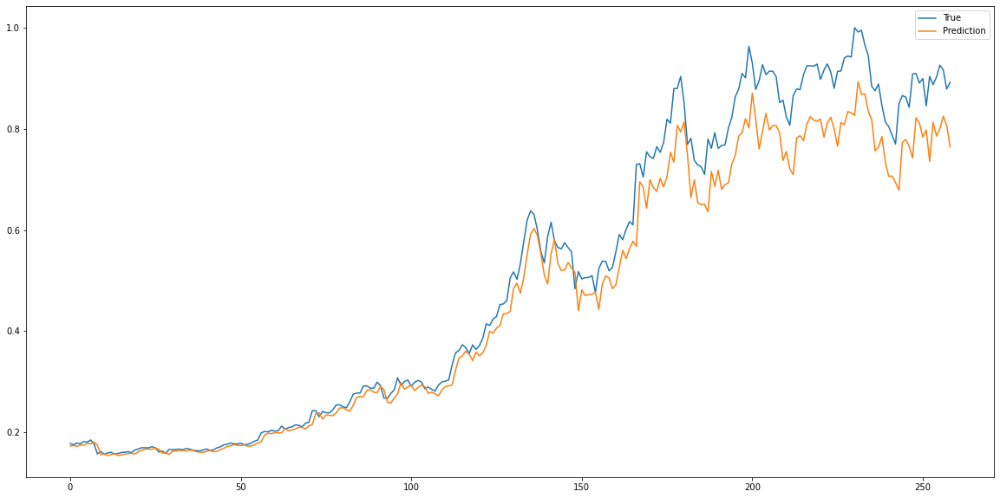
    


```python

```
